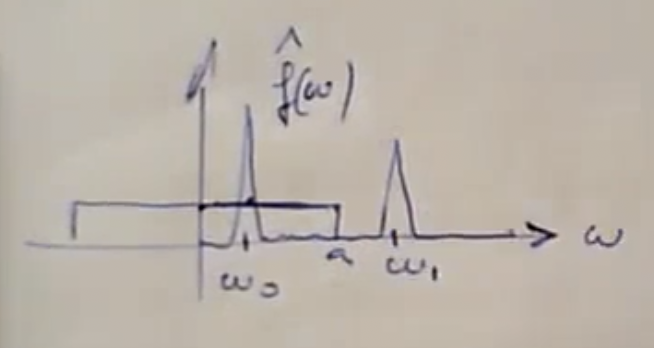

tags:: complanalisi

- # Definizione
	- Data una funzione $h: \R \to \C$ diciamo [[Filtro]] di [[Convoluzione]] l'operatore:
		- $A : f \to f*h = Af$
	- Sia $h \in \L1\R$. Allora $A$ è continuo, lineare e invariante per traslazioni:
		- da $\L∞\R$ a $\L∞\R$
		- da $\L2\R$ a $\L2\R$
		- da $\L1\R$ a $\L1\R$
	- ## Dimostrazione
		- ### ((64f0ed21-ef2f-4428-80d4-1a61c9c2fc60))
			- Ovvia, dato che $Af$ è definito dall'integrale:
				- ((64fb2fc8-5bd3-459c-8dd0-c676cae9bb95))
		- ### ((64f0ed21-ca43-460c-bd64-fcf998a8edf2))
			- $$A(τ_a f)(t) \stackrel{?}{=} τ_a Af(t)$$
			- $$
			  \begin{aligned}
			  A(τ_a f)(t) &= (τ_af * h)(t) \\
			  &= \fint f((t-s) - a) h(s)\,ds \\
			  &= \fint f((t-a) - s) h(s)\,ds \\
			  &= (f * h)(t -a) \\
			  &= τ_a(f *h )(t) \\
			  &= τ_a Af(t)
			  \end{aligned}
			  $$
		- ### ((64f0ed21-4164-4b05-9568-8d7d172e248b))
			- {{embed ((64f0ed21-c47f-480c-b48e-26df91decd36))}}
			- {{embed ((64fdf0c4-2499-4334-bad4-f472476173c9))}}
			- Considerando $c = \|h\|_\L1\R$:
				- $$\|f * h\|_\L∞\R \le \|f\|_\L∞\R \|h\|_\L1\R\quad\text{per }f \in \L∞\R$$
				- $$\|f * h\|_\L2\R \le \|f\|_\L2\R \|h\|_\L1\R\quad\text{per }f \in \L2\R$$
				- $$\|f * h\|_\L1\R \le \|f\|_\L1\R \|h\|_\L1\R\quad\text{per }f \in \L1\R$$
		- ### ((64f0ed21-ae48-441b-8daf-119dd7f5965d))
		  id:: 64fec451-e746-4ac0-addf-14fdcacdac11
			- Il filtro di convoluzione $f \to f * h$ è causale se e solo se $\supp h \subseteq [0, +∞)$
				- Dimostrazione 1:
					- ((64f0ed21-a972-43f4-bc03-9d7cd6d2084e))
					- Suppongo che $\supp h \subseteq [0, +∞)$ e dimostro $A$ causale
					- Sia $f(t) = 0 \,\forall t \le t_0$.
					- Allora:
						- $$
						  \begin{aligned}
						  \fint f(t-s) h(s)\,ds &= ∫_0^{+∞}f(t-s)h(s)\,ds
						  \end{aligned}
						  $$
					- Per $t \le t_0$:
						- $t - s \quad\le\quad t_0 - s \quad\le\quad t_0$
							- per $s \in [0, +∞)$
					- segue $f(t - s) = 0 \quad$
						- quindi $(f * h)(t) = 0$
				- Dimostrazione 2:
				  collapsed:: true
					- Suppongo $A: f \to f * h$ causale e dimostro che $\supp h \subseteq [0, +∞)$
					- $∀ t < 0 \Rightarrow h(t) = 0$
					- Per assurdo, si supponga esista un punto $t_0$ tale che $h(t_0) = 0$
					- $h(t_0) \in \C$, per cui è scomponibile in $a + ib$.
					- Perché non sia 0, $a \neq 0 \vee b \neq 0$
						- Suppongo $a \neq 0$.
							- Se $a > 0$:
								- Suppongo $h$ continua in $t_0$. Assunzione non necessaria, ma semplifica dimostrazione (è possibile dimostrare anche il caso più generale).
								- Allora deve esistere un intorno del punto in cui la funzione è positiva (teorema di permanenza del segno)
									- $\exists a, b > 0 | h(t) > 0 \forall t \in (-b, -a)$
								- Non è restrittivo che supporre $a > 0$
								- Ora prendo come segnale la ((63d5783c-0a5a-4449-9f80-6e80c87edbfe))
									- $$f(t) = χ_{[0, b - a]}(t)$$
								- $$
								  \begin{aligned}
								  Af(t) = (f * h)(t) &= \fint χ_{[0, b - a]}(t- s)h(s)\,ds
								  &= 
								  \end{aligned}
								  $$
								- Non completo, vedi ultimi sei minuti della lezione 6
					-
	- ## Funzione di trasferimento
		- Visto $A$ come filtro $A: \L∞\R \to \L∞\R$ risulta definita una ((64f19736-5f2a-413d-8e60-1a838fe63067)) $H(λ)$ tale che:
			- $$Ae_λ = H(λ)e_λ$$
				- $∀λ\in\R$
				- $e_λ = e_λ(t) = e^{2πiλt}$
		- Da notare che ha senso applicare $A$ ad $e_λ$ perché $e_λ \in \L∞\R$
- # Legame con [[Trasformata di Fourier]] #card
	- ## Funzione di trasferimento
		- Sia $h \in \L1\R$ e $A: f \in \L∞\R \to f*h \in \L∞\R$ il corrispondente filtro di convoluzione con funzione di trasferimento $H$. Allora $H = \hat h$
			- Dimostrazione
				- Poiché $λ \in \R$, si ha $e_λ(t) = e^{2πiλt} \in \L∞\R$
				- Dalla definizione di ((64f19736-5f2a-413d-8e60-1a838fe63067)) si ha:
					- $(e_λ * h)(t) = H(λ)e_λ(t)$
				- $h \in \L1\R$ può essere calcolato direttamente:
					- $$
					  \begin{aligned}
					  (e_λ * h)(t) &= \fint e^{2πiλ(t-s)}h(s)\,ds \\
					  &= e^{2πiλt} \fint e^{-2πiλs} h(s)\,ds \\
					  &= e_λ(t) \cdot \hat h(λ)
					  \end{aligned}
					  $$
				- Dunque $\hat h(λ) e_λ(t) = H(λ)e_λ(t)\quad ∀t$
				- Posto $t=0$, ho $\hat h(λ) = H(λ)$
					- Il valore puntuale non importa, dato che una $f(t) \in \L1\R$ non rappresenta un'unica funzione, ma una classe di funzioni che possono differire in un singolo punto e mantenere la loro uguaglianza.
	- ## Filtro di convoluzione come correzione del segnale
		- Sia $h \in \L1\R$ e $f \in \L2R$. Allora $A: f \in \L2\R \to f * g \in \L2\R$ e vale:
			- $$f * h = \F^{-1}[ \hat f \hat h]$$
			- Dimostrazione:
				- Per le proprietà della convoluzione, se $f \in \L2\R, h \in \L1\R \Rightarrow f * h \in \L2\R$
				- Inoltre $f * h = \F^{-1}\F[f * h] = \F^{-1}[\hat f \hat g]$
			- Questa proposizione si può scomporre in tre fasi:
				- **Analisi delle frequenze** tramite trasformata di Fourier $f \rightarrow \hat f$
				  logseq.order-list-type:: number
				- **Filtraggio delle frequenze** tramite moltiplicazione di $\hat f$ per $\hat h$, ovvero $H$
				  logseq.order-list-type:: number
				- **Ricostruzione del segnale filtrato** tramite trasformata di Fourier inversa: $\hat f \hat h \to \F^{-1}[\hat f \hat h]$
				  logseq.order-list-type:: number
		- Filtri di questo tipo si dicono anche **stazionari** perché  l'azione di filtraggio delle frequenze nella fase 2 avviene in modo indipendente dal tempo.
			- Ad esempio non è possibile filtrare frequenze in una certa banda fino a un istante $t_0$, e in una diversa banda dopo l'istante $t_0$.
			- Ciò è invece possibile tramite filtri di tipo diverso che usano (ad esempio) la [[Trasformata di Gabor]] invece di quella di Fourier.
	- Le proprietà precedenti si estendono a parecchi casi in cui $h \notin \L1\R$, in particolare nel caso $h(t) = \sinc_{2a}(t)$
- # Filtro di convoluzione del ((64eaeffe-fee4-4d2c-832e-cc123d1739e9)) #card
	- Il filtro di convoluzione $f \to f * \sinc_{2a}$ è un ((64fb8e55-6062-41e7-83a4-953e54c1921e)) ideale non [causale](((64f0ed21-ae48-441b-8daf-119dd7f5965d)))
	- Infatti le seguenti uguaglianze, valide con $f \in \L2\R, \sinc_{2a} \in \L2\R$:
		- $$
		  \begin{aligned}
		  f * \sinc_{2a} &= \F^{-1}\F[f * \sinc_{2a}] \\
		  &= \F^{-1}[\hat f \cdot \widehat {\sinc_{2a}}] \\
		  &= \F^{-1}[\hat f \cdot \widehat{\widehat{χ\,}}_{[-a, a]}] \\
		  &= \F^{-1}[\hat f \cdot  \tilde{χ}_{[-a, a]}] \\
		  &= \F^{-1}[\hat f \cdot χ_{[-a, a]}]
		  \end{aligned}
		  $$
			- Dato che:
				- $$
				  \begin{aligned}
				  \tildeχ_{[-a, a]} = χ_{[-a, a]}(-t) = χ_{[-a, a]}(t)
				  \end{aligned}
				  $$
				- ((64fe3e42-64de-43c2-8f60-80faf109adc3))
				- Inoltre, la ((63d5783c-0a5a-4449-9f80-6e80c87edbfe)) in $[-a, a]$ è simmetrica
		- 
			- $ω_0$, nell'intervallo $[-a, a]$, viene moltiplicata per uno e resta invariata.
			- $ω_1$ viene moltiplicata per 0 e sparisce.
		- Il filtro non è [causale](((64fec451-e746-4ac0-addf-14fdcacdac11))) perché $\supp \sinc_{[2a]} \nsubseteq [0, +∞)$
			-