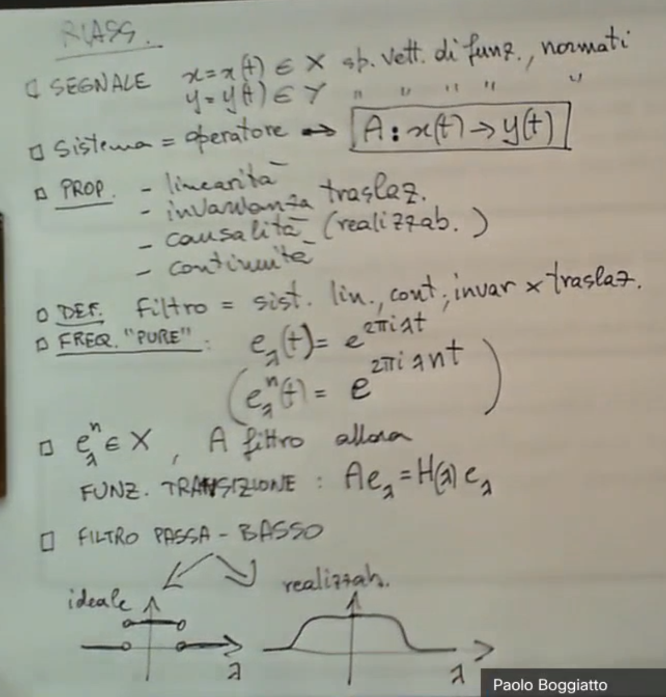
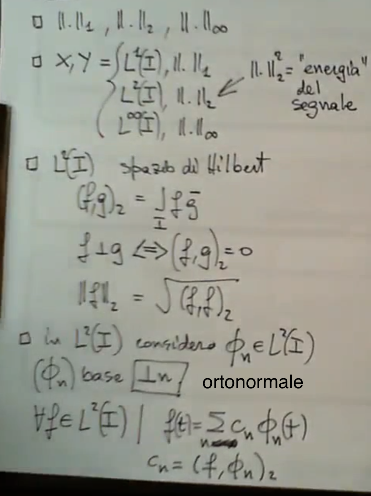

id:: 633efb18-b957-4b5e-9bf3-077fa788e9d0
color:: "#FF2400"
filters:: {"template" false}
banner:: https://images.unsplash.com/photo-1664581742527-b96b9e9a9783?ixlib=rb-4.0.3&ixid=MnwxMjA3fDB8MHxwaG90by1wYWdlfHx8fGVufDB8fHx8&auto=format&fit=crop&w=3115&q=80
moodle:: https://informatica.i-learn.unito.it/course/view.php?id=2522
icon:: ∫

- # Flashcard
	- {{cards (and (page-tags complanalisi) [[card]])}}
- {:height 822, :width 778}
- {:height 737, :width 302}
- ((64a504ea-8996-48b7-8ff6-2ff957969c4d))
- # Materiale
	- 
		- Lezione 1: tutto eccetto par 1.3.6 ed 1.3.7
		- Lezione 2: tutto eccetto par. 2.5
	- 
		- tutto (facoltative le appendici)
	- 
		- tutto
	- 
	- 
	- 
	- 
	- 
	- ![Appunti]
	- 
- # Parti #.ol
	- [[Segnale]] e [[Sistema]]
		- Siano
			- $x = x(t) \in X$
			- $y = y(t) \in Y$
		- funzioni in ((64eaeffe-3968-42cb-9047-566bc2b5b37b)) normati.
		- Un sistema è un operatore $A: x(t) \rightarrow y(t)$
		- ((64eaeffe-3d5c-41b6-a650-fb9050dc94a9))
			- Linearità
			- Invarianza per traslazione
			- Causalità
			- Continuità
		- ((64eaeffe-89d2-49f4-a49f-e0d3264f40d1))
			- Sistema lineare, continuo, invariante per traslazioni
			- Siano $e_\lambda \in X$, $A$ filtro, allora
				- Funzione di transizione: $Ae_\lambda = H(\lambda)e_\lambda$
		- Filtro passa-basso
	- [[Trasformata di Fourier]]
	-